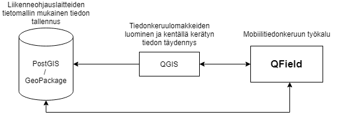

# QField-mobiilisovellus liikenneohjauslaitteiden inventointiin

Väylävirasto ja [Gispo Oy](https://www.gispo.fi/) ovat toteuttaneet alkuvuonna 2021 projektin, jossa edistettiin QField-mobiilisovelluksen käyttöä LOL-inventointiin (LOL = liikenneohjauslaitteet).

Tähän repositorioon kootaan kaikki projektiin liittyvät tuotokset:

 - [Testiprojekti](qfield_testiprojekti/README.md) kansiosta löytyy
   esimerkkiprojekti, jolla QFieldiä voi testata ja QGIS-projekti, jonka voi kääntää QFieldiin sopivaksi mobiiliprojektiksi.
  - [PostGIS-tietomalli](lol_postgis/README.md) pohjautuu
   Tampereen Infra Oy:n kanssa kehitettyyn liikennemerkkien
   tietomalliin. Sen pohjana on käytetty [Digiroadin aineistotoimituksen
   käsitemallia.](https://vayla.fi/vaylista/aineistot/digiroad/tieliikennelaki-2020/ohje-viranomaiselle/aineiston-toimitus-massatoimituksella)

## Miten pääsen alkuun?

 1. Kloonaa tai lataa tämän repositorion sisältö itsellesi.
 2. Asenna QField mobiililaitteeseesi [Andoidin Play-kaupasta.](https://play.google.com/store/apps/details?id=ch.opengis.qfield) 
 3. Siirrä [QField offline-projekti mobiililaitteeseesi](qfield_testiprojekti/qfield_projekti_offline)
 4. Avaa QField laitteella ja avaa siellä paikallinen projekti (lataamasi testitiedosto)

Tällä prosessilla pääset aloittamaan LOL-tietojen keruun offline-muodossa oletustietomallilla. Tiedot voit siirtää takaisin tietokoonnelle mobiililaitteelta ja tarkastella niitä esimerkiksi QGIS-työpöytäsovelluksella. Mikäli haluat kerätä tietoja verkkoyhteyden yli, voit luoda oman PostGIS-tietokannan hyödyntäen [valmista tietomallia.](lol_postgis/README.md)

## Mikä QField?

[QField](https://github.com/opengisch/QField) on avoimen lähdekoodin mobiilisovellus, jonka teknologia pohjautuu QGIS-työpöytäohjelmistoon. QField on ennen kaikkea kenttätyökalu, jolla voidaan tuottaa erilaista vektoridataa QGIS-projektiin. Lue lisää QFieldistä sovelluksen omasta  [dokumentaatiosta](https://qfield.org/docs/fi/).

## Taustaa

Väyläviraston hallinnoiman kansallisen avoimen datan tietojärjestelmän Digiroadin puolella on tehty LOL-tietojen keruun mahdollistamiseksi käsitemallia jo aiemmin. Liikenteenohjauslaitetietojen toimittaminen Väyläviraston tietojärjestelmään -ohje perustuu kesällä 2020 voimaan tulleeseen uuteen tieliikennelakiin (729/2018). Uuden lain myötä tienpitäjällä on velvoite toimittaa tietoja asetetuista liikenteenohjauslaitteista, kuten liikennemerkeistä, ajoratamaalauksista ja liikennevaloista Väylävirastolle, joka hallinnoi tietoja Digiroad-tietojärjestelmässä. Lopullisena tavoitteena on helpottaa kuntien tietojen siirtämistä Digiroadiin.

Sekä tietomallin että QFieldin testaukseen on osallistunut Gispon asiantuntijoiden lisäksi kolme eri kokoista ja alkuasetelmiltaan erilaista kuntaa: Ylöjärvi, Kouvola ja Nurmes sekä Tampereen Infra Oy. Testaukseen osallistuvilta kunnilta kerättiin palautetta, jonka pohjalta inventointiprosessia kehitetään eteenpäin. 