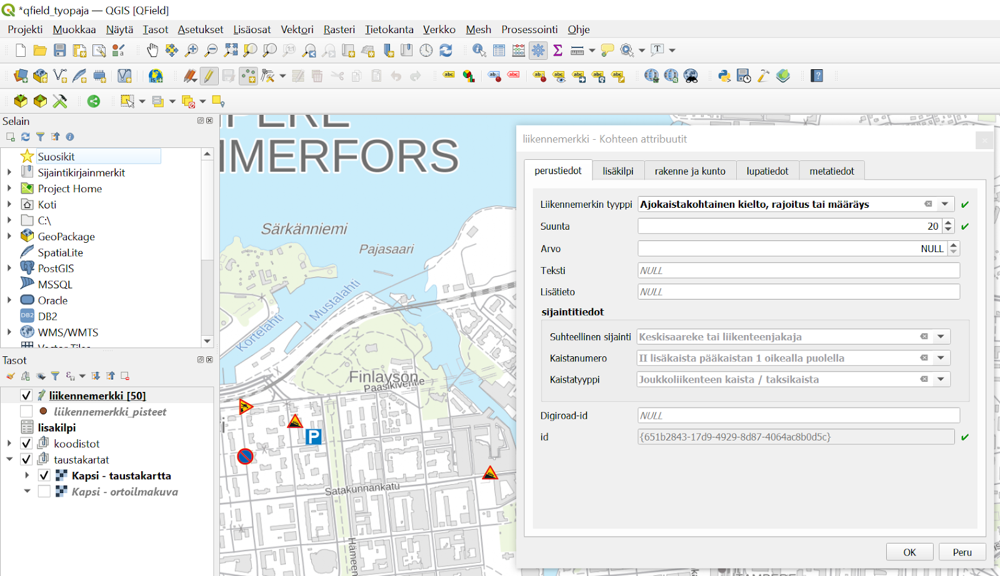

# QField-testiprojekti

Tämä kansio pitää sisällään QField-testiprojektin, sekä QGIS-esimerkkiprojektin.

Käytännössä QGISin puolella voidaan tehdä työtila ja luoda mahdollinen tietokantayhteys ja relaatiot taulujen välillä. Lisäksi QGISin puolella määritellään käytettävä koordinaattijärjestelmä ja taustakartat. Tämän jälkeen QGISIn työtila paketoidaan QFieldille sopivaksi QGISin lisäosalla ja viedään saatu tiedostopaketti mobiililaitteeseen QField-sovelluksen käyttöön.

Projekti on tuotettu QGISin versiolla 3.16. 
